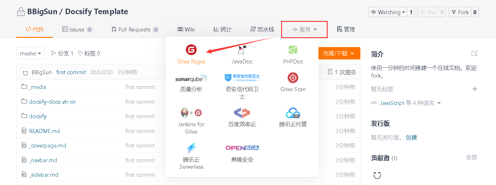
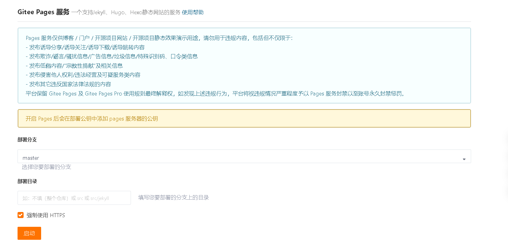
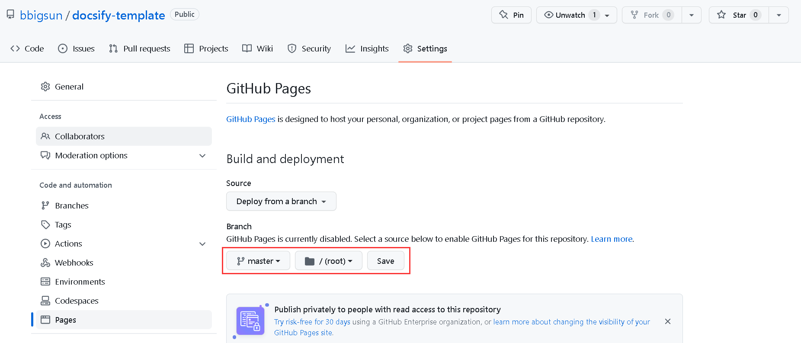
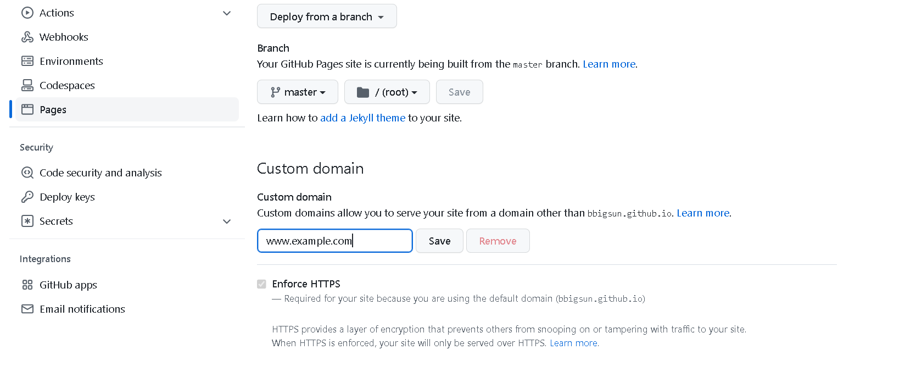

## 🪶 Docsify Template

?> 这是一个使用 Docsify 搭建在线文档的模板。本文主要介绍如何搭建自己的在线文档

关于 [docsify](https://github.com/docsifyjs/docs-zh) ，一个神奇的文档网站生成器。docsify 可以快速帮你生成文档网站。不同于 GitBook、Hexo 的地方是它不会生成静态的 `.html` 文件，所有转换工作都是在运行时。如果你想要开始使用它，只需要创建一个 `index.html` 就可以开始编写文档并直接[部署在 GitHub Pages | Gitlab Pages | Gitee Pages | Firebase主机 | VPS | Netlify | ZEIT Now | AWS Amplify | Docker](https://docsify.js.org/#/zh-cn/deploy)。

- `_media` : 图片存放位置（必须存放在这里）
- `_coverpage.md` : 封面
- `_navbar.md` : 导航
- `_sidebar.md` : 自定义侧边栏，无则显示当前文章的目录
- `index.html` : 渲染模板文件
- `README.md` : 网页显示的内容
- `index-online.html` : 渲染模板文件，使用在线 css 和 js 文件
- `index-local.html` : 渲染模板文件，将 css 和 js 文件提前缓存到本地
- `docsify` : 提前缓存的 css 和 js 文件

#### 👉 使用 Gitee Pages 搭建在线文档

?> 演示地址：<https://bbigsun.gitee.io/docsify-template>

1、将本项目 fork 到个人仓库 

2、开启 Gitee Pages 服务

- 必须为开源仓库
- 需要实名认证

3、使用 Gitee Pages 服务部署

#### 👉 使用 GitHub Pages 搭建在线文档

?> 演示地址：<https://bbigsun.github.io/docsify-template/>

1、将本项目 fork 到个人仓库 

2、开启 GitHub Pages 服务

- 必须为开源仓库
- 不需要实名认证
- 需要 `.nojekyll` 文件

3、使用 GitHub Pages 服务部署

4、使用自定义域名

?> 参考：https://docs.github.com/zh/pages/configuring-a-custom-domain-for-your-github-pages-site

#### 🚩 提高网站加载速度

?> 将所需的 css 和 js 文件存放在本地，可以提高网站的加载速度。  

目前使用的是本地的 css 与 js 文件。

- 使用本地的，将 `index-local.html` 文件替换 `index.html` 文件。
- 使用在线的，将 `index-online.html` 文件替换 `index.html` 文件。

#### 🍿 联系作者

如果觉得对您有帮助，欢迎 fork and star。

如果需要本人的帮助，请添加本人 QQ：2394665208。